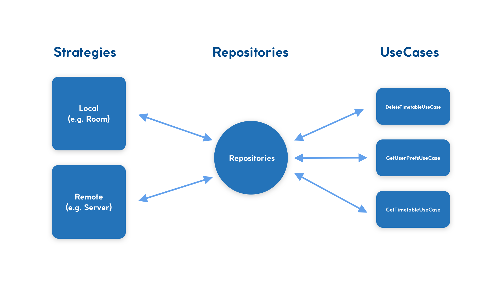

# eléncho - Unibz Timetable

## Motivation
In September 2019 I have started my first semester of Computer Science at the Free University of Bolzano and since the first days I was struggling with the online timetable. There were many issues with the timetable: it was slow, unreliable and very complex to use. Therefore after I few weeks I decided to take on a small side project which consisted of building an Android app to better manage my timetable. The main motivation that drove me to develop this app was my will to explore the new Android Jetpack and architectural patterns.  
**Disclaimer: some architectural patterns used in this application are over-engineered for my use case, but the project was only for learning purpose.**
## The concept
At first I wanted to build a really simple one activity application however it mutated into something more really quick. As soon as I started developing the application I had into my mind a lot of different cool ideas, which then have seen form into the current version of the app (that is still under development).
## The architecture
The architecture adopted in this app is a mixture of ideas from the Clean Architecture and the Model-View-ViewModel. Therefore the main components of app business logic can be divided into:
* **Strategies**: they contain all the logic for getting data from a specific data source (e.g. website, database...).
* **Repositories**: they use multiple strategies and choose which one to ask for data in relation to different conditions (e.g. absence of internet connection...).
* **UseCases**: they contain logic that will perform operations on data (e.g. filtering, mapping...).

